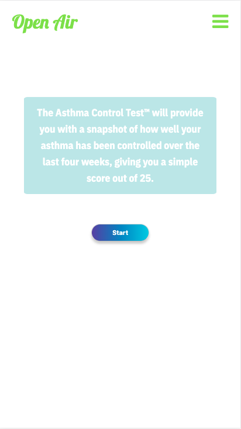

# Open Air 

Open Air is a platform that helps asthmatic patients manage their condition.

## Getting Started

In the project directory, you can run:

```bash
npm install

npm start
```

Runs the app in the development mode.<br />
Open [http://localhost:3001](http://localhost:3001) to view it in the browser.

### Prerequisites

You will need to run the back end of this project which can be found [here](https://github.com/anamecia/mod-5-project-back-end)

## Registration

  

It is mandatory to have an Open Air account for the user to be able to use the app. 

## Home Page 


Home Page shows the user the current weather condition, air quality, quantity of air pollutants and pollen count, based on the user's current location. All these parameter can affect asthmatic patients. 

## My Drugs Page

 

Users can add their rescue drugs (used by asthmatic patient for asthma attacks) and regular drugs (used every day as preventers).
For each drug the users can:
- log every time they take the medicine, decreasing the number of remaining doses
- delete drug
- open in a new tab the drug information leaflet
- reset number of doses

## Asthma Control Test 

Users can take an Asthma Control Test once a month to check how well control their asthma has been for the past 4 weeks. At the end of the test the user is given a score and a small description.



## Notes


Users can take notes, edit and delete them.

## Report


Users have access to a resport that shows a chart with the rescue drug usage for the last 7 days or 30 days, as well as the last 6 Asthma Control Test scores.


